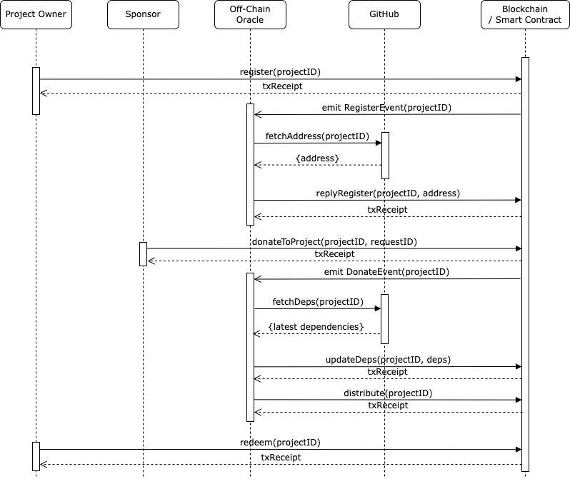

# Open Source Pizza
This is a proof of concept project for distributing sponsorship to open source projects using smart contracts on the Ethereum blockchain.

By automatically distributing the sponsorship, projects that get used a lot by other projects will passively receive rewards that are proportional to their popularity.

## Architecture
This project uses 2 on-chain smart contracts, 1 off-chain oracle client and GitHub as the centralized off-chain source of truth. A sequence diagram outlining interactions between the different components are as follows.


In short, the project owner will register by calling the smart contract function with the GitHub project id. Whenever there's a donation to a project, the off-chain oracle will fetch the project dependencies from GitHub. For demo purpose, this project reads dependencies from `package.json` only, but the GitHub client can be expanded to support different languages/project management tools. As an example, Project A imports Project B and Project C. When there's a donation to Project A, the off-chain oracle will identify Project B and Project C as dependencies and split and distribute the donation to all 3 projects.

## To build and deploy the smart contracts and oracle listener
### Set Up
```
npm install
npm install -g truffle
```

### Set up testnet accounts
1. export wallet account mnemonic and save to `.secret`
1. export wallet address 0 private key and save to <keyfile>

### Compile contracts
```
truffle compile
```

### Deploy contracts
```
# start local ethereum node
geth account import <keyfile>
geth --http --http.port 8545 --http.api eth,net,web3,personal

truffle migrate
```


## Compile and Deploy listener
```
# export environmental variables from sample.env
npx tsc && node build/oracleListener.js
```


